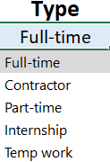

# 📊 EXCEL DASHBOARD : Data Jobs Salary Analysis

This Excel Dashboard provides a comprehensive analysis of salaries and trends in various data-related job roles. By exploring multiple job attributes such as job titles, median salaries, top hiring platforms, and job types, the dashboard offers valuable insights for job seekers, recruiters, and data professionals.

Based on the **Excel Dashboard** you’ve shared, here’s a set of **clear and concise objectives** tailored specifically to your project:

---

## 🎯 **Project Objectives: Data Jobs Salary Calculator Dashboard**

1. **Explore Salary Trends Across Data Job Roles**

   * Visualize and compare salaries of popular data-related positions such as Data Analyst, Data Scientist, and Machine Learning Engineer.

2. **Identify Median Salary by Role, Country, and Job Type**

   * Calculate and display the median salary based on user-selected filters like job title, country, and employment type.

3. **Highlight the Most Active Job Platforms**

   * Determine which platform (e.g., Indeed, LinkedIn, etc.) lists the highest number of data-related job openings.

4. **Analyze Job Distribution by Employment Type**

   * Compare salary ranges and job availability across employment types such as full-time, part-time, contract, and internships.

5. **Provide Geographic Insights**

   * Incorporate a world map to illustrate global job distribution and facilitate country-level salary analysis.

6. **Summarize Job Market Volume**

   * Display the total number of data-related job listings to assess market demand in a selected region.

## 📁 Project Structure
- `data/`: Raw dataset used in the analysis. The data jobs dataset used is from Luke Barrahouse's Excel course. 
- `analysis/`: Cleaned data and Excel workbook with charts and pivots.
- `visuals/`: 

 ###  Screenshots below : 

 ###  CHARTS :

### KPI's

### Filters :

## 📈 Tools Used
- Microsoft Excel 

   📉 Charts

   🧮 Formulas and Functions

   ❎ Data Validation
- Data cleaning and visualization

## 🧠 Key Insights

- Senior data jobs have the highest average salary.

- Data Analyst have the highest number of job count.

- Full-time jobs have the highest average salaries, followed closely by contractor and part-time roles.

- Internships and temporary work tend to offer lower compensation, as expected.

- Entry- to mid-level roles like Data Analyst and Business Analyst are on the lower end of the salary spectrum.

## CONCLUSION

This **Data Jobs Salary Analysis project** offers valuable insights for aspiring data professionals by shedding light on industry salary standards, job availability, and hiring trends. By leveraging interactive Excel dashboards, the analysis uncovers the **average salaries** across various **data-related job titles**, highlights the **most in-demand platforms**, and reveals the **distribution of job types** such as full-time, part-time, contract, and internships.

Additionally, the dashboard supports **country-level comparisons**, enabling users to explore how location influences compensation and job volume. This project equips job seekers, career changers, and industry analysts with **data-driven guidance** to make informed career decisions in the growing field of data science and analytics.

